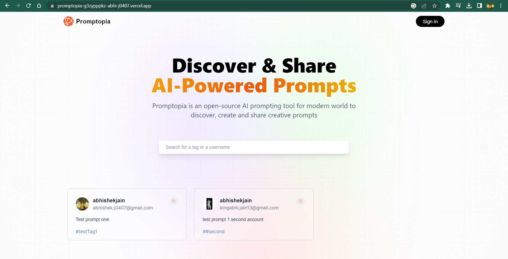
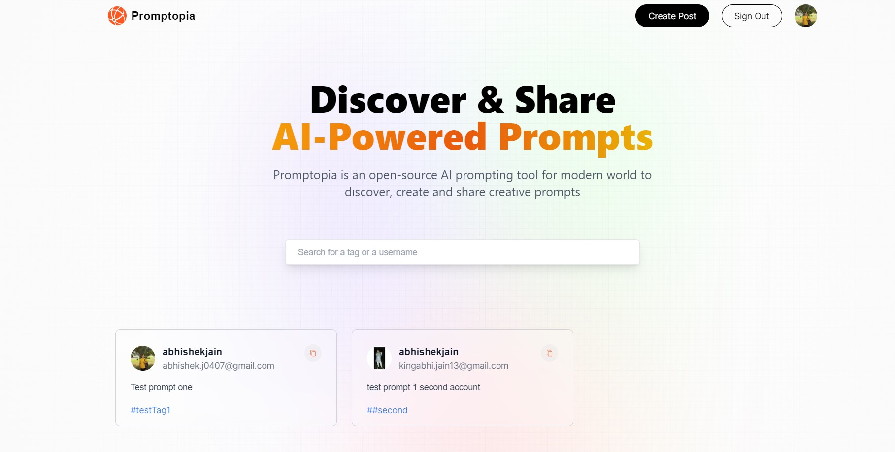
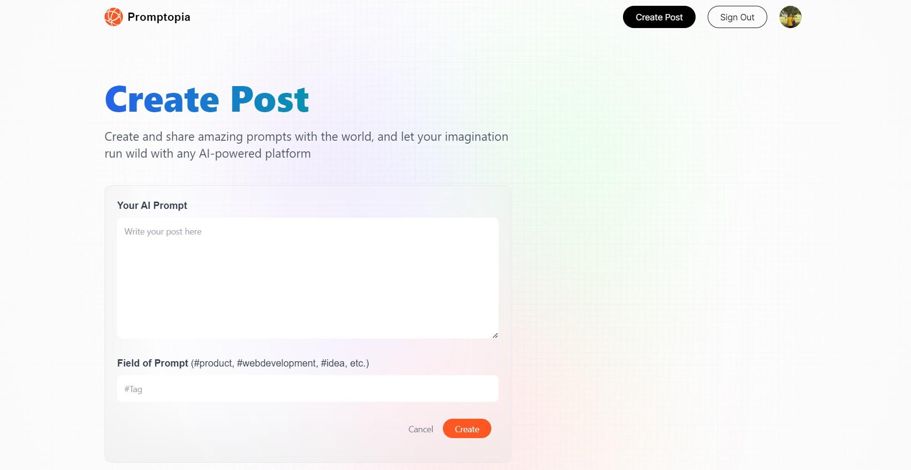
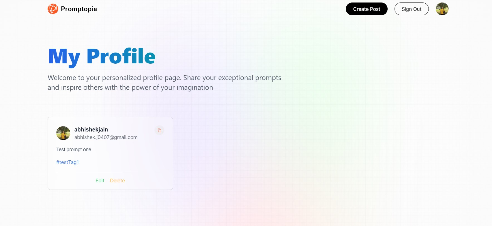

# Screenshots

# Description

- A full stack app with Next.js.
- Serves as a platform to post and explore AI prompts.
- Ability to create profiles, login using Google Auth, Search and filter by User/Tags, and Edit and Delete functionalities for posts.

# Instructions

- Clone repository from 'https://github.com/abhi-j0407/promptopia.git'
- Change directory to project folder, and run 'npm install' in terminal to install the required dependencies.
- To run project, run command 'npm run dev'.
